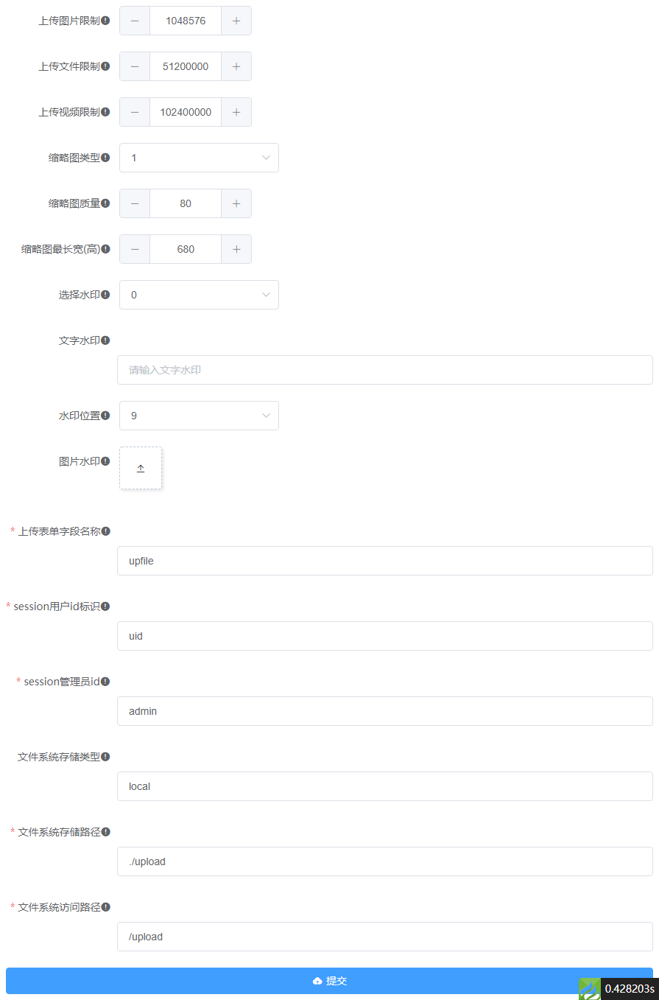
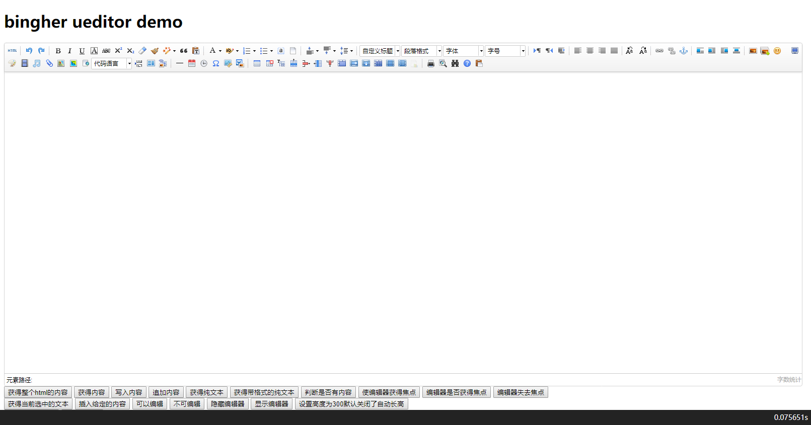
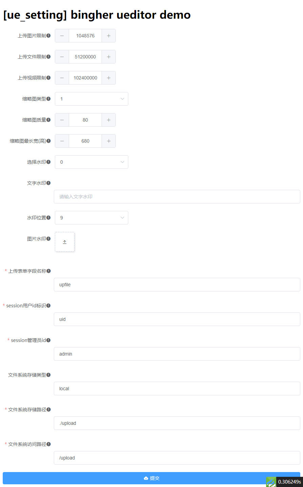

# bingher/ueditor
> thinkphp6 ueditor 插件

## 安装
```
composer require bingher/ueditor
```

## 资源及数据库配置
```
php think ueditor:publish
php think migrate:run
```
以上操作将会复制静态资源文件到`/public/static/bingher/ueditor`目录下,在数据库中创建`ueditor_config`配置表

## 配置
配置文件`config/ueditor.php`
```
    // 上传大小限制，单位B  102400=100KB, 512000=500KB,1048576=1M
    'max_image_size'         => 1048576,
    // 上传大小限制，单位B，默认100MB
    'max_vedio_size'         => 102400000,
    // 上传大小限制，单位B，默认50MB
    'max_file_size'          => 51200000,
    // 0 不做缩略图,缩略图模式参考\think\Image::THUMB_*常量
    'thumb_type'             => 1,
    //缩略图图片清晰度设置，默认是80
    'thumb_image_quality'    => 80,
    //获取图片宽高的最大限制值，0为不限制
    'thumb_max_width_height' => 680,
    //是否加水印(0:无水印,1:水印文字,2:水印图片
    'water'                  => 0,
    //水印文
    'water_text'             => '',
    //水印位置,默认右下角 参考\think\Image::WATER_*常量
    'water_position'         => 9,
    //水印图片路
    'water_image'            => '',
    //上传表单字段
    'upload_field_name'      => 'upfile',
    //用户session账号i
    'session_uid_key'        => 'uid',
    //超级管理员uid
    'super_admin_uid'        => 'admin',
    //磁盘类型
    'filesystem_type'        => 'local',
    //磁盘路径
    'filesystem_root'        => app()->getRootPath() . 'public/upload',
    //磁盘路径对应的外部URL路径
    'filesystem_url'         => '/upload',
    //权限控制函数
    'auth_control'           => 'check_uid',
```
如果有做数据迁移,将以数据库中的`ueditor_config`配置为主,你可以访问`http://你的域名/ueditor/setting/index`进行配置,示例:


> 使用独立配置的`filesystem`
配置`config/filesystem.php`增加`ueditor`的配置项,示例:
```
return [
    'default' => 'local',
    'disks'   => [
        ...
        'ueditor' => [
            'type'         => 'aliyun',
            'accessId'     => 'aliyun OSS accessId',
            'accessSecret' => 'aliyun OSS accessSecret',
            'endpoint'     => 'aliyun OSS endpoint',
            'bucket'       => 'aliyun OSS bucket',
            'url'          => 'aliyun OSS url', //不要斜杠结尾，此处为URL地址域名。
        ],
```
> 以上配置引用了`thans/thinkphp-filesystem-cloud`,请自行安装
```
composer require thans/thinkphp-filesystem-cloud
```


你也可以在你的网站管理后台的某个系统设置的页面模板中使用`{:ue_setting()}`就可以自动生成以上的表单进行配置了


## 使用
在模板文件中需要引入的地方加入以下代码
```
{:ue_view()}
```
ue_view方法如下:
```
function ue_view(string $name = 'ueditor',string $content = '',array $config = []){...}
```
|参数|说明|
|-|-|
|$name|生成的插件id及表单提交字段name,默认ueditor,同一个页面需要多个ueditor,需要分别设定|
|$content|初始化内容,在需要编辑的时候传入编辑文本内容|
|$config|配置项,参考ueditor.config.js|

> 注意事项
关闭`APP_DEBUG`(生产环境)后,默认会验证session(`session_uid_key`)是否有值,如果配置你的系统不是存储session('uid'),请自行配置对应的用于验证权限的键名,默认验证方法是`check_uid`,可以更改配置`auth_control`为验证权限的方法即可(注意bool类型的返回)

## DEMO
#### ue_view
> http://你的域名/ueditor/demo/view



#### ue_setting
> http://你的域名/ueditor/demo/setting



## 开发
- js压缩
    - vscode 安装minify
    - 在js页面执行`Minify`
